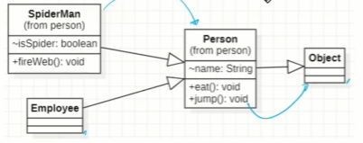

### 목차

---

## 상속 (Inheritance)

상위 클래스의 멤버를 하위 클래스에서 재사용, `extends` 키워드 사용

```java
// 조상, 상위, 슈퍼 클래스
public class Person {
    String name;

    void eat(){}
    void jump(){}
}

// 자식, 하위, 서브 클래스
public class SpiderMan extends Person {
    boolean isSpider;
     void fireWeb;
}

public class Main {
    public static void main(String[] args) {
        SpiderMan spiderMan = new SpiderMan();

        spiderMan.name = "name";
        spiderMan.isSpider = true;
    }
}
```


자식 -> 부모

> Object 클래스
>
> 모든 클래스의 조상 클래스
> 모든 클래스에는 `extends Object`가 생략되어 있음.
> `Object` 메소드에는 `hashCode`, `equals`, `toString` 등이 있다.

상속의 관계는 is a(kind of) 관계라고 한다.



`Person is a Object`

`Employee is a Person`

`Employee is a Object`

### 단일 상속 (Single Inheritance)

여러 클래스를 기능을 물려받을 경우 관계가 매우 복잡해진다.

자바는 단일 상속만 지원하고 interface나, 포함 관계(has a)로 단일 상속의 단점을 보완한다.

```java
public class Spider {
    void jump();
}

public class Person {
    void jump();
}

// 에러 발생
public class SpiderMan extends Spider, Person{

}

public class Main {
    // Person, Spider 중 누구의 jump??
    SpiderMan.jump();
}
```

### 포함 관계

2개 이상의 클래스에서 특성을 가져올 때 하나는 상속, 나머지는 멤버 변수로 처리한다.

```java
public class SpiderMan extends Person {
    Spider spider = new Spider();
}
```


### 메서드 오버라이딩(Overriding)

조상 클래스의 메서드를 자식 클래스에서 재정의 하는 것

```java
public class Person {
    void jump() {
        System.out.println("jump");
    }
}

public class SpiderMan extends Person {
    void jump() {
        System.out.println("Spider jump")
    }
}
```

- 메서드명 동일
- 매개변수 동일
- 리턴타입 동일
- 접근제한자는 부모보다 범위가 넓거나 동일
- 조상보다 더 큰 예외 던질 수 없음

### super

```java
class Parent {
    String x = "parent";
}

class Child extends Parent {
    String x = "child";

    void method() {}
        System.out.println(x)
        System.out.println(this.x)
        System.out.println(super.x);
    }
}

```

`this()`처럼 `super()`로 조상 클래스 생성자 호출

자식 클래스 생성자의 맨 첫 줄에만 호출 가능

`extends`한 클래스가 없을 경우 `Object`의 기본 생성자 호출

명시적으로 `this()`, `super()`를 선언하지 않을 경우 컴파일러가 `super()`호출

```java
public class Person extends Object {
    String name;

    public Person(String name) {
        // super() // 생략해도 컴파일러가 호출
        this.name = name;

        // this.name = name; 을 생략해서, 코드 절감 가능
        // super(name)
    }
}
```

> 변수 scope
>
> 사용된 위치에서 점점 확장해서 처음 만난 선언부로
> method 내부 -> 해당 클래스 멤버 변수 -> 조상 클래스 멤버 변수

---

## Annotation

컴파일러, JVM, 프레임워크 등이 보는 주석

소스코드에 메타 데이터를 삽입하는 형태

코드에 대한 정보 추가 -> 소스 코드의 구조, 환경 설정 추가 등

### 기본 annotation

- @Override

  - 컴파일러에게 해당 메서드가 Override된 것임을 알려줌

  ```java

  // 에러 발생
  @Override
  void jamp() {

  }

  // 에러 미발생
  void jamp() {

  }
  ```

```

- @Deprecated

    - 컴파일러에게 Deprecated 되었다고 알려줌

    - 추후 삭제될 우려가 있으니 사용 권장하지 않음

- @SupperessWarnings

    - 컴파일러에게 사소한 warning을 신경쓰지 말라고 알려줌
```

---

## Package

클래스 파일들을 담고 있는 디렉터리

`.`을 통해 계층적 접근

`package name + class name` 으로 클래스 구분 -> `fully qualified name`

생략 시, default package 생기나 비권장

패키지는 0 ~ 1 개

### 일반적인 package naming 룰

소속.프로젝트.용도

com.ssafy.hrm.common

---

## import

`package`와 `class` 선언 사이에 위치

여러번 선언 가능

### 선언 방법

import 패키지명.\*
import 패키지명.클래스명

- import 단축키
  `Ctrl + Shift + o`
  `Ctrl + Spacebar`

### default import package

- java.lang.\*;

> 중복된 클래스명을 명시적으로 표기하여 사용
>
> `java.awt.List list`

> 컨벤션
> 

## 제한자

클래스, 변수 메서드 선언부에 함께 사용

### 접근 제한자

- public, protected, (default = pakage) , private

### 그 외 제한자

- statc
- final
- abstract
- snchronized

순서는 무관하나, 일반적으로 접근 제한자를 맨 앞으로 사용하고, 접근 제한자는 하나만 사용 가능

### final

더 이상 바꿀 수 없음

### final class

더 이상 확장 불가능 : 상속 금지 -> 오버라이딩 방지

```java
final class PerfectClass {}
// 에러 발생
public class classTest extends PerfectClass {}
```

> `String`, `Math`

### fianl method

더 이상 재정의 불가능 : 오버라이딩 금지

```java
class Parent {
    public final void finalMethod(){}
}

class FinalClassTest extends ParentClass {
    // 에러 발생
    public void finalMethod(){};
}

```

### final variable

상수, 더 이상 값을 바꿀 수 없음

```java
public void A(final String name) {
    // Error
    name = 3;
}
```

생성자에서 꼭 한 번 초기화 해줘야 함

```java
class P {
    final String bloodType;

    public Person(String bloodType) {
        this.bloodType = bloodType
    }
}

```
