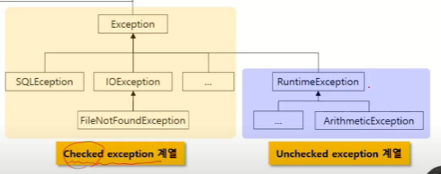
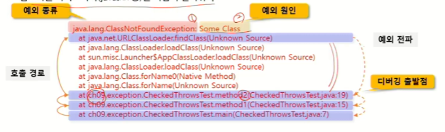
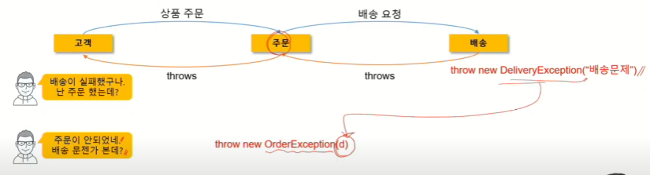

## 목차

1. <a href="#1">에러와 예외</a>
1. try-catch
1. try-catch-finally
1. try-with-resources

---

## <font id = "1"> 에러와 예외</font>

### 에러

프로그램을 잘못 작성한 경우, 디버깅으로 코드를 개선한다.

> 메모리 부족, Stack Overflow 등

### 예외

에러의 내용을 디버깅으로 개선하거나,

프로그램의 작성 의도와 달리 사용되는 경우, 예외 처리 코드로 상황을 수습한다.

> null인 객체의 사용, 1/0, 읽으려는 파일이 없음

**예외처리**를 통해 비정상 종료를 막고(예외 감지) 정상적인 실행 상태를 유지(동작 코드 작성)한다.

### 예외 클래스의 계층

모든 예외의 `Throwable` 클래스를 상속받는다.



#### checked exception

- 예외에 대한 대처 코드가 없으면 컴파일이 진행되지 않음

#### unchecked exception (RuntimeException의 하위)

- 예외에 대한 대처 코드가 없더라도 컴파일은 진행

> 예외 대처 코드가 존재하는지 컴파일러가 체크하는지 여부에 따라 구분

### Unchecked Exception

`Unchecked Exception`은 컴파일시에 에러가 발생하지 않고, 런타임 때 에러가 발생한다.

```java
int intArray = { 10 };

try {
    // 예외가 발생할 수 있는 코드
    System.out.println(intArray[2]);
} catch (ArrayIndexOutOfBoundsException e) {
    // 예외가 발생했을 때 처리할 코드
    System.out.println("예외 처리 완료");
}
```

`JVM`은 예외 발생시, `new Exception`을 생성하고 이를 `throw`로 `catch()`로 보내게 된다.

```java
// 발생된 예외의 대한 구체적인 메시지 반환
public String getMessage()
// 예외의 원인이 되는 Throwable 객체 또는 null 반환
public Throwable getCause()
// 예외가 발생된 메서드 까지의 호출 스택을 출력, 디버깅 수단으로 사용
public void printStackTrace()
```

우리도 JVM과 마찬가지로 `throw new Exception()`을 던질 수 있다.

이 때, 해당하는 예외를 처리하는 `catch`가 있어야 한다.

```java
int intArray = { 10 };
int unExcute = 0;

try {
    System.out.println(intArray[2]); // throw new ArrayIndexOutOfBoundsExcpetion();
    unExcute = 3;
} catch (IOException | ClassNotFoundException e) { // 못 잡음
    e.printStackTrace();
} catch (ArrayIndexOutOfBoundsExcpetion e) {
    e.printStackTrace();
} catch (Exception e) {
    // 다형성을 통해, 그 외의 모든 Exception을 처리함 -> Exception클래스는 모든 예외의 부모
}

System.out.println(unExcute); // 0
```

여러 `catch` 블록을 통해 여러개의 다중 `exception handling`이 가능하다.

일반적으로 작은 범위(자식)에서 큰 범위(조상)순으로 정의 한다.

만약 `try`에서 특정 예외가 발생하는 `...Exception`을 잡는 `catch`가 없다면 `Unreachable catch block for ...Exception`

### Checked Exception

```java
    // 컴파일 에러, ClassNotFoundException
    class.forName("ClassName");

    // 컴파일 에러, FileNotFoundException
    new FileINputStream("someFile.txt");

    // 컴파일 에러, SQLException
    DriverManager.getConnection("Hello");
```

예외 발생 위험이 있으니 대처코드를 생성하라는(`Checked Exception`) 컴파일 에러 발생

> 심각하지 않는 예외는 세분화 하여 처리 하지 않고, 예외를 상황별로 처리 하기 위해선 세분화 해야 한다. -> 주로 하나의 Exception으로 처리하는건 지양한다.

## finally

`finally`는 예외 발생 여부와 상관없이 항상 실행된다.

중간에 `return`을 만나도 `finally`를 먼저 실행한 후 리턴을 실행한다.

```java
try {
    ...
    return;
} catch (...) {
    ...
} finally {
    System.out.println("항상 실행");
}
```

`finally`는 주로 자원 정리에 이용된다.

```java
class InstallApp {
    void install() throws Exception {
        if (Math.random() > 0.5) {
            throw new Exception();
        }
    }

    void delete() {
        System.out.println("파일 삭제");
    }
}

class Main {
    public static void main(String[] args) {
        InstallApp app = new InstallApp();
        try {
            app.install();
        } catch (Exception e) {
            e.printStackTrace();
        } finally {
            app.delete();
        }
        // app.delete(); ???
    }
}
```

유지보수를 위해 `try - finally` 관계가 형성되는 로직을 묶어서 처리하도록 한다.

즉, `try` 블록에서 사용한 리소스를 반납하는 로직을 `finally`에 작성한다.

`resource leak` 방지 차원에서 `finally` 사용을 지향해야 한다.

## try-with-resource

`jdk 1.7` 이상에서 사용한다.

`finally`를 사용하지 않아도 `try(...)` 소괄호 안에 선언된 `resource`를 자동으로 해제한다.

```java

try (FileInputStream input = new FileInputStream("tmp.txt");) {
    input.read();
} catch (FileNotFoundException e  {
    e.printStackTrace();
} catch (Exception e  {
    e.printStackTrace();
}
```

## throws

처리해야 할 하나 이상의 예외를 호출한 곳으로 전달한다.

```java

void methodCaller () {
    // 최종적으로 try-catch로 예외를 처리해야 한다.
    try {
        exceptionMethod();
    } catch(Exception e) {
        ...
    }
}

void exceptionMethod() throws Excpetion1, Exception2{
    // 예외 발생 시, 호출한 메소드에 예외 전달
}
```

### checked Exception

```java

main () {
    try {
        method();
    } catch (FileNotFoundException e) {
        e.printStackTrace();
    }
}

void method() throws FileNotFoundException{
    FileInputStream input = new FileInputStream("ABC.txt");
}
```

무조건 예외 발생 메소드에서 `throws`로 예외를 던져줘야 한다.

### unChecked Exception

```java

main () {
    try {
        method();
    } catch (ArithmeticException  e) {
        e.printStackTrace();
    }
}

void method() {
    int a = 1 / 0;
}

```

예외를 `throws`로 던져주지 않아도 자동으로 예외를 던져준다.

> 결국 예외의 종류와 무관하게 항상 `try catch`로 예외를 잡아줘야 한다.

### printStackTrace

메서드 호출 스택 정보 조회, 최초 호출 메서드부터 예외 발생 메서드 까지의 스택 정보 출력

예외 종류, 예외 원인, 디버깅 출발점을 확인할 수 있다.

여기서 직접 작성한 코드를 디버깅 대상으로 삼아야 한다.

디버깅을 할 때는, 참조하는 라이브러리는 넘겨도 괜찮다.



### throws의 목적과 API 활용

내부적으로 Java API가 예외를 처리한다면, 개발자는 상황을 인지하지 못한다.

Java API가 throws로 개발자에게 예외를 전파한다면 개발자는 이를 인지하고 적절한 예외를 처리한다.

### 메서드 재정의와 throws

```java
class Parent {
    void methodA() throws IOException{}
    void methodB() throws ClassNotFoundException{}
}

class Child extends Parent {
    void methodA() throws FileNotFoundException() {}
    // 컴파일 에러 발생
    void methodB() throws Exception() {}
}
```

### 예외 변환

하위 계층에서 발생한 예외를 상위 계층에 맞는 예외로 바꿔 던진다.

즉, 메소드를 호출한 곳에 알맞는 예외를 전달해야 한다.



이를 통해 하위 계층 예외의 원인을 상위 계층에서 전달받아 새롭게 처리

```java

public static void main(String[] args) {
    delivery();
}

private void delivery() {
    deliveryToCustomer();
}

private void deliveryToCustomer () {
    throw new RuntimeException("도로 결빙");
}
```

고객은 도로 결빙 정보가 아닌 다른 정보를 받고싶음.

```java

public static void main(String[] args) {
    try {
        delivery();
    } catch (RuntimeException e) {
        // IllegalStateException을 통해 새로운 예외를 발생해서 처리
        throw new IllegalStateException(e);
    }
}

private void delivery() {
    deliveryToCustomer();
}

private void deliveryToCustomer () {
    throw new RuntimeException("도로 결빙");
}
```
