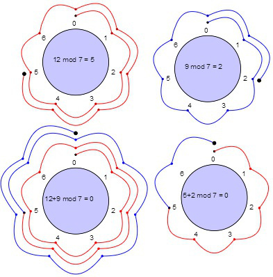

$\displaystyle (n! )\over \displaystyle (n - r)! * r!$ mod 1234567891

오일러 공식

m과 a가 서로소, $ a^{\displaystyle \emptyset(m)} = 1 mod(m)$

${\emptyset(m) =}$ m이하의 m과 서로소인 수의 개수

페르마 공식

a와 p가 서로소, $a^{p-1} = 1 mod (p)$

1. n!을

p가 소수이면 a와 p가 서로소라는 점이 보장된다.

## 모듈러 합동

A ≡ BmodC

A와 B는 C에 대한 합동, A와 B는 동치류이다.

1 = 4mod3

1 = 7mod3

7과 4는 3에 대한 합동(동치류)이다.

4 ≡ 7 mod 5

이를 통해 어떤 수의 모듈러 연산에서 C를 도출할 수 있다.

여기서 x가 17 mod 4와 합동이라면

x mod 4 = 17 mod 4 와 같다는 것을 의미한다.

## 동치식

$A ≡ B mod C$면, $A mod C = B mod C$ 이다.

여기서 $A = B + K * C$ 가 성립하면 동치이다.

K는 임의의 정수이다.

즉, 4 ≡ 7 mod 3 이라는 합동이 존재할 경우 이를 증명하기 위해선 동치식을 세워봐야 한다.

$4 ≡ 7 mod 3$

$4 = 7 + (K * 3)$ 
$7 + 3K = 4$  
$K = -2$

$13 ≡ 23 mod 5$

$13 = 23 + (K * 5)$  
$5K = -10$ 
$k = -2$

결국, 모듈 C에 대한 합동 관계가 동치관계라는 것을 증명한다.

이를 통해 세 가지 특성을 도출할 수 있다.

- 반사성

  A ≡ A (mod C)

- 대칭성

  A ≡ B (mod C)  
  B ≡ A (mod C)

- 추이성

  A ≡ B (mod C)  
  B ≡ D (mod C)  
  A ≡ D (mod C)  

## 나머지 정리

A = C \* Q + R

어떤 식에서 정수 A를 양의 정수 C로 나눴을 때, 몫 Q와 나머지 R이 존재한다.

이를 모듈려 연산으로 표현하면, $R = A mod C$

## 모듈러 덧셈

$(A + B) mod C$ 는 $(A (mod C) + B (mod C) )mod C$

먼저 A + B를 나눗셈 정리로 표현하면,

$A = C * Q_1 + R_1$

$B = C * Q_2 + R_2$

$A + B = C ( Q_1 + Q_2) + R_1 + R_2$

이를 다시 모듈러 연산에 대입하면

$(A + B) mod C$

$( C(Q_1 + Q_2) + R_1 + R_2)mod C $

좌변의 C는 modC에 의해서 제외할 수 있다. C에 modC를 적용하면 C의 값은 의미 없기 때문이다.

> 그림으로 살펴보기
>
> 모듈러 덧셈시 한 바퀴를 도는 연산은 제외하고 값을 구할 수 있다.

즉, A % C 의 값만을 구하고, B % C의 값을 구하여 더하는 방식의 증명을 그림으로 쉽게 확인할 수 있다.

---

## 모듈러 곱셈

$(A * B)modC$

이를 나머지 정리로 전개하면

$(A = C * Q_1 + R_1)$

$(B = C * Q_2 + R_2)$

이를 모듈러 식에 대입하면

$(A*B) modC$

$( (C * Q_1 + R_1) * (C * Q_2 + R_2)) modC$

$C(C*Q_2*Q_2) + Q_1(C*Q_2*R_2) + R_1(C*Q_2*R_2)$

$C(C * Q_2 * Q_2) + Q_1(C * Q_2 * R_2) + R_1 * (C * Q_2 * R_2)$

## 모듈러 거듭제곱

거듭 제곱을 지수 법칙을 이용해서 분할할 수 있다.

$100 ^100 = 100^10 * 100^90$

이를 모듈러 대입하여 곱셈의 풀이법으로 계산한다면

$(3^90 mod4) = (3^40 mod 4 * 3^50 mod 4) mod 4$

값을 쉽게 계산하기 위해 계산하기 쉬운 지수(ex. 10)등, 원하는 지수로 쪼갤 수 있지만 연산의 횟수가 증가하게 된다.

### 빠른 계산 방법

앞서 곱셉 법칙을 생각해보자.

$(A^2 mod C)$ 는 $(A*A)modC$와 동일하다.

이를 모듈러 식에 대입하면, $(AmodC * BmodC)modC$를 구할 수 있다.

예제1. $3^256 mod 5$

$3^2 mod 5 = 1$

$3^4 = (3^2 mod 5) * (3^2 mod 5) mod 5$ 
$= 1 * 1 mod 5$

$3^8 = 1 * 1 mod 5$ 
...

이렇게 A^B mod 5 == 1이 나오게 된다면, 256은 2의 제곱이므로 더 이상 계산할 필요 없이, 1이 나오게 된다.

> 이를 활용한 2진수 변환을 통한 더 빠른 계산법도 존재

## 모듈러 역수

$1 / A = C$ 
$1 = A * C$

정수에서의 역수는, 어떤 수를 자신의 역수로 곱하면 1이 된다.

A의 역수 1 / A

$1 = (A) * (1 / A)$

모듈러에서의 역수는 $A modC == 1$을 만족하는 값이다.

역수는 $A*A^{-1}modC = 1$ 이다.

A와 C와 서로소인 경우만 모듈러 역수를 가지게 된다.

$(A * A^{-1}) ≡ 1 (mod C)$ 
$(A * A^{-1}) mod C = 1$

즉, A의 역수는 $A*B mod C = 1$ 을 만족하는 B의 값이다.

2mod6

### 유클리드 호제법

나머지 정리를 이용한 방식으로 최대공약수를 구할 수 있다.

---

페르마 정리의 곱셈 공식을 이용하기 위해서 나눗셈을 곱셈으로 변환해야 한다.

오일러 공식은 $a^{\emptyset(m)} 은 1 (mod m)$이다.

$1234567891$은 소수이고 이 값의 최대 공약수는 1과 본인밖에 존재하지 않는다.

그렇기 때문에 a^m = 1 mod m

즉, 페르마의 정리인 a^P = a mod P와 동일한 식을 갖게 된다.

이는 페르마의 소정리인 a^{P-1} = 1 mod P 로 변환할 수 있다.

$n! / r * (n - r)! mod 1234567891$
