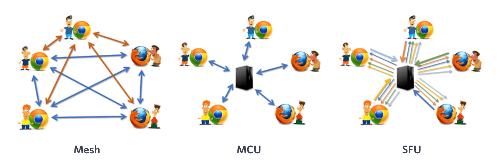

## WebRTC

WebRTC는 웹 브라우저 간에 플러그인의 도움 없이 플러그인을 사용하여 오디오, 비디오 및 데이터를 교환할 수 있도록 설계된 프로젝트입니다. WebRTC는 Google, Mozilla, Opera 및 Ericsson에 의해 개발되었습니다.

WebRTC는 연결 방식에 따라 Mesh, SFU, MCU 등 다양한 방식으로 구현할 수 있습니다.

### Mesh

Mesh는 WebRTC의 가장 간단한 구현 방법입니다. Mesh는 모든 피어가 서로 연결되어 있어야하며, 각 피어는 다른 모든 피어와 연결되어 있어야합니다. 이 방법은 피어가 많을 때 비효율적입니다.

Mesh 방식의 가장 큰 단점은 peer의 수가 많아질수록 네트워크의 복잡성이 증가하고, 대역폭이 낭비된다는 것입니다.

Mesh의 연결 구조를 일반항으로 표현하면 $2(n-1)/2$ 이 됩니다.

### SFU

SFU는 Selective Forwarding Unit의 약자로, WebRTC의 중간 서버 역할을 하는 것입니다. SFU는 피어가 서로 직접 연결되는 Mesh와 달리, 중간 서버를 통해 데이터를 전달합니다.

중간 서버를 통해 peer간의 데이터를 전달하기 때문에, peer간의 연결을 유지할 필요가 없어지고, 대역폭을 효율적으로 사용할 수 있습니다.

SFU에서 peer는 중간 서버에게만 연결하고 중간 서버가 이를 처리하여 다른 peer에게 전달합니다.

### MCU

MCU는 Multipoint Control Unit의 약자로, SFU와 유사하게 중간 서버 역할을 하는 것입니다.

MCU는 SFU와 달리, 중간 서버는 연결되는 peer 당 1대1로 연결됩니다.
