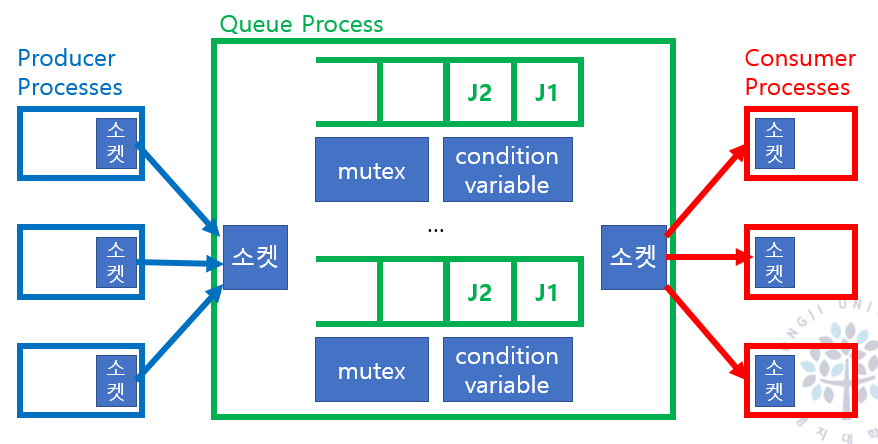

웹의 기본적인 프로세스는 클라이언트가 서버에 요청을 보내고 서버는 요청에 대한 응답을 보내는 것이다.

이 과정에서 일반적으로 `HTTP(S)`로 `API`를 요청하면 `API Gateway`는 `mTLS`, `JWT` 또는 `API Key`를 사용하여 요청의 출처를 파악하고 적절한 마이크로서비스로 라우팅해주는 역할을 한다.

`API Gateway`는 안전한 `API` 유통과 `Client`를 요쳥벌료 백엔드 서비스로 라우팅하는 역할을 한다.

이 외에도 `API Gateway`는 서버로 들어오는 트래픽에 대한 다양한 관리 기능을 제공한다.

# API Gateway

`API Gateway`는 고유한 `API Gateway Pattern`을 가지고 있다.

이는 `MSA(Microservice Architecture)`에서 여러 `MSA`를 묶어 클라이언트에게 호출해주는 방법이다.

## Gateway Routing Pattern

`client`에서는 `getOrders`, `getProducts`등, `API Gateway`로 내부 서비스를 동작한다.

단순하게 들어온 요청에 대한 `API`를 1대1로 라우팅 하는 역할을 한다.

외부 개발자는 모든 `client`의 `end point`를 확인할 필요가 없다는 장점이 존재한다.

이는 `API Gateway` 설정만으로도 충분하게 기능을 제공받을 수 있다.

## API Gateway Pattern

`API Gateway Pattern`은 실제로 다음과 같은 로직을 가지고 있다.

클라리언트의 서비스 로직을 `API Gateway`가 찾아서 해당 요청을 처리할 서비스들을 찾아서 묶어서 `client`에게 전달한다.

즉, getProductOrder() 요청이 들어오면, `API Gateway`는 `getProduct`와 `getOrder`를 찾아서 묶어서 `client`에게 전달한다.

즉 취사선택하여 `API Gateway`가 `client`에게 서비스를 제공한다는 것이 핵심이다.

`API Gateway`가 단순히 요청에 맞는 `API`를 찾아서 제공하는 것이 아니라, 필요한 `API`를 묶어서 취사 선택하여 `client`에게 제공한다는 것이다.

단순 라우팅이 아니라는 점이 중요하다.

`Spring Cloud Gateway`나 `Netflix Zuul`과 같은 API Gateway Framwwork 와 무과나핟.

`API Gateway`의 대표적인 오픈 소스로 `Netflix Zuul`, `Kong`, `Apigee` 등이 있다.

이 중, `Netflix-Zuul`은 `Spring Cloud` 기반으로 `Netflix OSS`에서 개발한 `API Gateway`이다.

`Spring`의 `Filter`를 사용하여 `API Gateway`를 구현할 수 있다.

## 3-tier Architecture (Monolithic Architecture)

비즈니스 레이어는 저장소에 접근 도메인 로직 수행하는 계층이다.

프레젠테이션 계층은 외부 클라이언트 요청 받아 비즈니스 계층을 호출하고 Client에 맞는 뷰를 생성하여 반환하는 계층이다.

프레젠테이션의 `Facade`는 클라이언트 요청이 하나의 비즈니스 요청이 아니라 여러 비즈니스 로직이다.

여기서 `MSA`에서 MicroService는 비즈니스 계층을 담당하고, `API Gateway`는 프레젠테이션 계층을 담당한다.

여기서 `API Routing Gateway`를 만들게 될 경우, `Filter`만 남은 `API Gateway`가 탄생한다.

많은 `API Gateway Framework`는 이런 `Filter`를 사용하여 `API Gateway`를 구현한다.

하지만, `Filter`만을 사용하는 방식은 많은 문제점을 야기한다.

## API Gateway Framework의 한계

`API Gateway`에서의 보안은 단순히 특정 `API`의 접근만을 제어하는 것이 아니다.

해당 `API`가 처리하는 객체의 접근 또한 제어할 수 있어야 한다.

만약 `Get(.../{userid})`라는 것이 존재한다면, 실제 사용자가 1번 아이디를 가지고 있어도 2번 아이디의 객체 로직에도 접근할 수 있게 된다.

이를 해결하기 위해선, 단순히 `Filter`만을 사용하면 해결할 수 없다.

이에 대한 가장 큰 문제점으로 `IDOR` 수평적 권한 상승이 존재한다.

`client`에게 API 비즈니스 로직의 구현을 전가한다. 이것이 해커에게 공격의 대상이 된다.

이런 `Facade`를 또 `MSA`에게 전가하면 특정 서비스 개발자들은 알지도 못하는 로직 구현의 책임을 맡게 된다. 이는 결합도의 증가로 이어진다.

MS가 `client`의 요청을 지속적으로 감시해야 한다는 문제점이 발생한다.

## LoadBalacner + APIGateway

