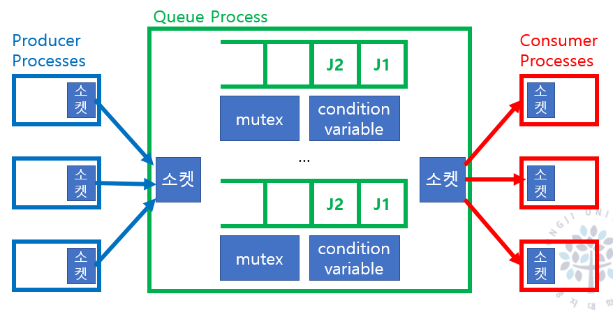
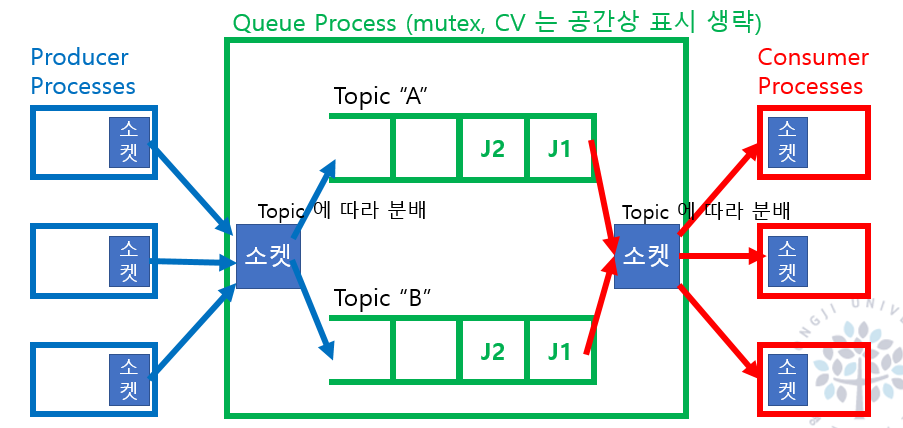

여러개의 서버가 존재할 경우 RPC를 통해 상호간의 통신을 한다.

RPC는 동기화 방식을 통해 함수를 호출하는 형식으로 소통한다.

서비스를 개발할 때, 다양한 요청을 처리해야 한다. 이때, 요청을 처리하는 방식은 동기와 비동기로 나뉜다.

서비스에서 동기 처리를 하게 되면, 요청을 처리하는 시간이 길어지면 사용자는 대기하게 된다. 이때, 비동기 처리를 하게 되면, 요청을 처리하는 시간이 길어지더라도 사용자는 대기하지 않고 다른 작업을 할 수 있다.

즉, 서비스에서의 비동기 처리는 선택이 아닌 필수이다.

이러한 비동기 방식을 처리하기 위한 대표적인 아키텍쳐로, `Producer`와 `Consumer`로 나뉘어진 `Message Queue`가 있다.

## Producer Consumer

Producer와 Consumer는 MessageQueue를 사용하되, Mutual Exclusion을 통해 Producer와 Consumer가 동시에 접근하지 않도록 한다.

이런 방식으로 Polling 방식이 발생하므로, condition variable을 통해 Consumer가 MessageQueue에 메시지가 있는지 확인하고, 없으면 대기하도록 한다.

Consumer와 Producer는 Queue를 중심으로 Decoupling된 효과가 있다.

이러한 Message Queue를 통해 서로 다른 서버 간의 통신을 할 수 있다.

이러한 `Message`를 단순히 `Message Queue`에 발행하고, `Consumer`가 구독하여 처리하는 것이 아니라, `Message`에 대한 `Event`를 발행하고, `Consumer`가 `Event`를 구독하여 처리하는 것이 `Event Driven` 방식이다.

외부에 별도로 존재하는 프로세스와 통신하는 경우, InterProcess Communication을 통해 통신한다.

대표적으로 Socket이나 Shared Memory 등을 사용한다.

Message Queue는 별도의 프로세스에 존재한다. 여기서 서로 통신하는 방식은 Socker을 통해 통신한다.

I/O Multiplexing을 통해 여러개의 소켓을 관리하고, 이벤트가 발생하면 이벤트를 처리한다.

이러한 방식으로, Message Queue를 통해 서로 다른 서버 간의 통신을 할 수 있다.

## Message Queue

Message Queue에서 전송하는 `Message`를 `Topic`이라고 한다.

Message는 L7에서의 Switch(Router) 기능을 통해 `Message`를 `Topic`에 따라 MessageQueue로 분배한다.

Producer의 Interface는 job을 추가하고, Consumer의 Interface는 job에 따라 handler를 등록 및 호출한다.

이러한 방식을 Message Queue에서는 `Publish`와 `Subscribe`라고 한다.

이러한 방식을 통해, 서로 다른 서버 간의 통신을 할 수 있다.

## MSA

이런 Message Queue의 방식을 통해 MSA를 구현할 수 있다.

작은 서비스들은 각자의 도메인을 가지고, 독립적으로 동작한다.

각자의 서비스들은 느슨하게 연결되어야 한다. 즉, 서로의 도메인을 알지 못하고, 서로의 도메인을 변경하지 않아야 한다.

이를 통해 재사용 가능한 서비스를 만들 수 있다. 이런 방식을 구현하기 위해 REST를 사용하거나, Message Queue 방식을 사용할 수 있다.

Queue는 LoadBalancer와 비슷하나 다르다. LoadBalancer는 서버 풀이 꽉 차면 요청을 버리지만, Queue는 요청을 버리지 않고 가지고 있는다.

이 때문에 MSA는 Stateless하게 구현된다.

이 State를 사용하기 위해서는 외부 DB를 사용해야 한다.

### Communication Pattern

**Unicast**: 특정 대상에게 메시지 전달

	특정 Consumer를 위한 전용 Queue를 사용한다.

**Multicast**: 특정 그룹에게 메시지 전달

특정 topic의 queue에 여러 consumer가 pubscribe한다. queue가 복제하여 consumer에게 전달한다.

**Broadcast**: 모든 대상에게 메시지 전달

	모든 consumer가 pubscribe하여 메시지를 전달받는다.

**AnyCast**: 특정 그룹 중 아무나 하나에게 전달

## MessageQueue 솔루션

### RabbitMQ

AMQP(adavanced message queuing protocol)를 지원하는 오픈소스 메시지 브로커이다.

메시지를 어떤 queue에 보낼지 routing을 위해 exchange라는 개념이 존재한다.

이 때문에 유연한 routing이 가능하다.

message를 consumer에게 push하고 consumer가 message를 받으면 queue에서 삭제한다.

### Kafka

RAM 사용시 발생하는 overhead를 피하기 위해 disk에 의존한다.

DISK는 Seek Time이 발생하기 때문에 속도가 느리다.

`Kafka`는 이러한 문제를 해결하기 위해 Sequential I/O를 사용한다.

데이터를 순차적으로 읽고 쓰기 때문에, Disk Seek Time이 줄어 높은 `Throughput`을 얻을 수 있다.

데이터를 지우는 오버헤드를 줄이기 위해, append-only log 방식을 이용한다. 작업 로그를 저장하고, 이를 통해 데이터를 복구한다.

Producer는 Queue에 들어오는 내용을 계속 뒤에 append하고 disk에 저장한다. Consumer는 offset을 통해 자신이 읽은 위치를 기억하고, 이후에 읽을 때 offset을 이용해 읽는다. 이 때문에 `Kafka`는 pull 방식으로 Consumer에게 Message를 전달한다.

> LinkedIn 에서 log processing을 통해 user activity log를 분석하는데 사용한다.

| |Rabbit MQ | Kafka|
|--|--|--|
| Throughput(MB/s) | 수십 | 수백 |
|메시지 보관 | Consumer 전달 시, ACK가 발생하면 삭제. | 기본적으로 디스크에 저장, 설정으로 일정 시간 경과 후 삭제 가능 |
| 메시지 전달 유연성 | smart broker + dump consumer | dumb broker + smart consumer |
| 메시지 전달 방식 | push | pull |
| 클러스터링 | mirroring  | Zookeeper |
|사용용도 | 복잡한 라우팅을 통해 여러 단계에 걸친 작업 처리 (비디오 인코딩) |  단일 단계에서 대규모 데이터를 처리하는데 용이 (사용자 행동 로그 처리)

## RPC vs MessageQueue vs REST

서버 통신에 있어서, RPC와 Message Queue의 차이점은 다음과 같다.

- RPC
  - 동기화 방식
  - 함수를 호출하는 형식
  - 서버가 죽으면 클라이언트도 죽는다.

- Message Queue
  - 비동기화 방식
  - 메시지를 발행하고, 구독하는 형식
  - 서버가 죽어도 메시지는 남아있다.

- REST
  - HTTP를 통해 통신
  - Stateless
  - 서버가 죽어도 클라이언트는 살아있다.

# 출처

- https://sjh836.tistory.com/185
- https://docs.spring.io/spring-cloud-commons/docs/current/reference/html/#switching-between-the-load-balancing-algorithms
- https://www.inflearn.com/questions/691643/spring-cloud-gateway-load-balancer-%EB%B0%A9%EC%8B%9D-%EC%A7%88%EB%AC%B8-%EC%9E%85%EB%8B%88%EB%8B%A4
- https://happycloud-lee.tistory.com/221
- https://harveywoods.tistory.com/entry/Kafka-Producer%EC%99%80-Consumer
- https://firebase.google.com/docs/auth/admin/create-custom-tokens?hl=ko&_gl=1*fqhzw2*_up*MQ..*_ga*MTczMzc5MTk0NS4xNzE1NTc1ODA0*_ga_CW55HF8NVT*MTcxNTU3NTgwMy4xLjAuMTcxNTU3NTgwMy4wLjAuMA..

